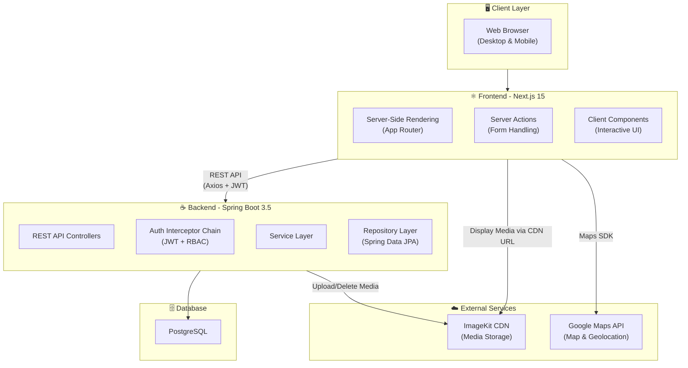
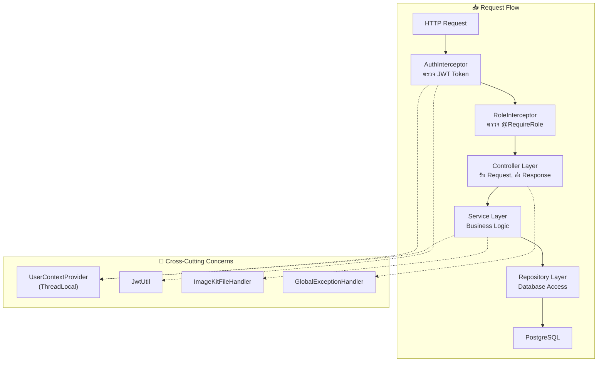
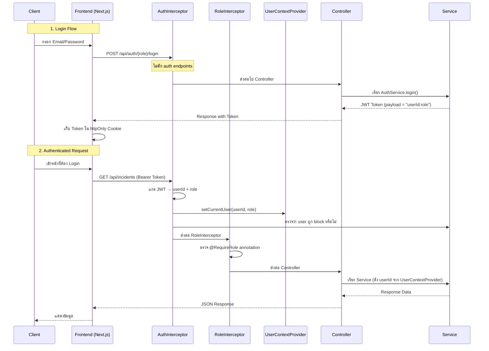
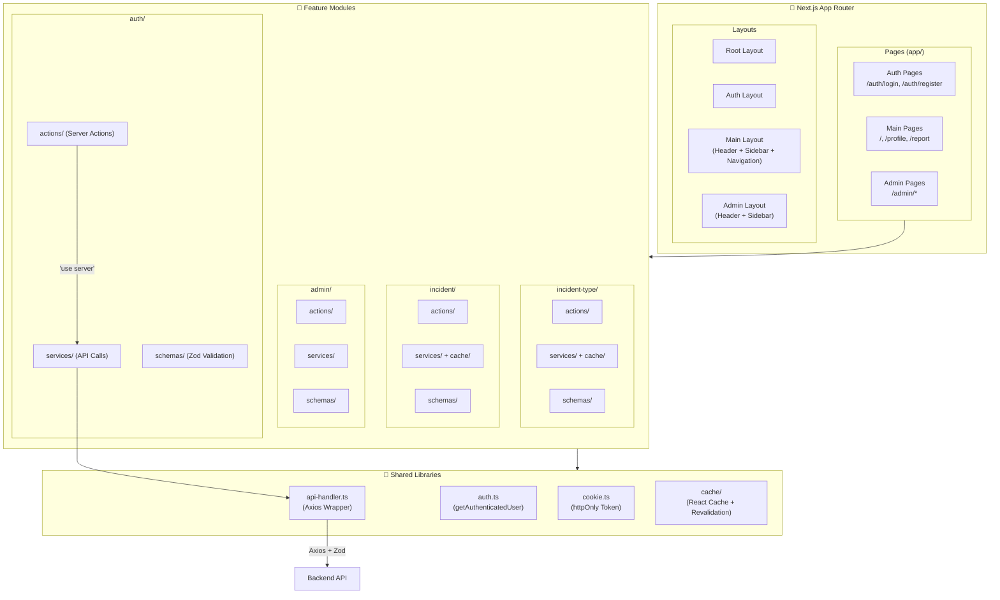
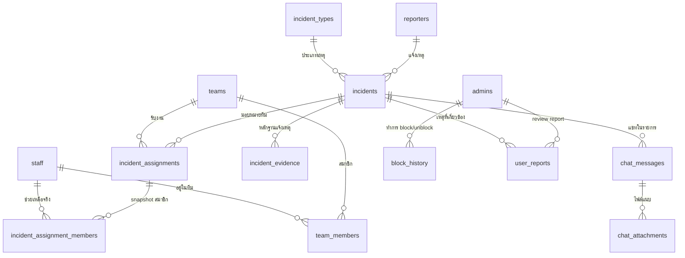
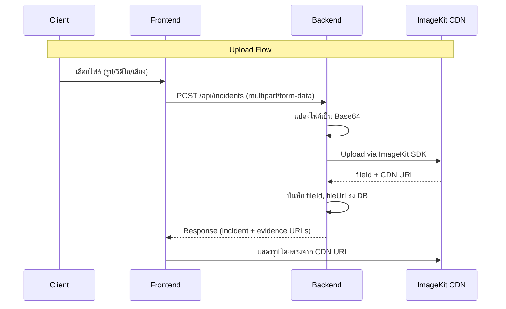
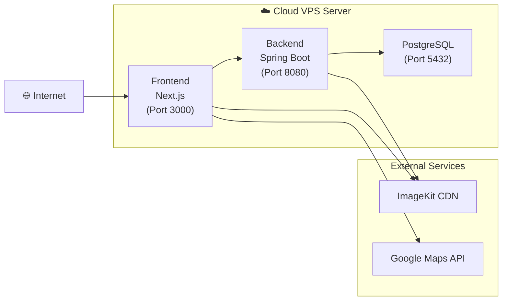

# System Architecture

**ระบบปักหมุดแจ้งเหตุฉุกเฉินเรียลไทม์ในมหาวิทยาลัยขอนแก่น**
*(Real-time Emergency Pin-Alert Web Application for Khon Kaen University)*

---

## 1. High-Level Architecture Overview

ระบบเป็น **เว็บแอปพลิเคชัน (Web Application)** ที่ใช้สถาปัตยกรรมแบบ **Client-Server** แยก Frontend และ Backend ออกจากกันอย่างชัดเจน โดยสื่อสารผ่าน **RESTful API** พร้อม **JWT Authentication** รองรับการใช้งานผ่าน Web Browser ทั้งบน Desktop และ Mobile



---

## 2. Technology Stack

### 2.1 Frontend

| เทคโนโลยี | เวอร์ชัน | หน้าที่ |
|-----------|---------|--------|
| **Next.js** | 15.5.14 | Web Framework (App Router, SSR, Server Actions) |
| **React** | 19.1.0 | UI Library |
| **TypeScript** | ^5 | Type Safety |
| **Tailwind CSS** | v4 | CSS Framework |
| **ShadCN / Radix UI** | 4.1.0 / 1.4.3 | UI Component Library |
| **Axios** | 1.13.6 | HTTP Client |
| **Zod** | 4.3.6 | Schema Validation (Request/Response) |
| **Google Maps** | `@vis.gl/react-google-maps` 1.7.1 | Map Display & Geolocation |
| **Lucide React** | 0.577.0 | Icon Library |
| **React Toastify** | 11.0.5 | Toast Notifications |
| **SweetAlert2** | 11.26.24 | Dialog/Confirmation Popups |
| **next-themes** | 0.4.6 | Dark Mode / Theme Switching |

### 2.2 Backend

| เทคโนโลยี | เวอร์ชัน | หน้าที่ |
|-----------|---------|--------|
| **Spring Boot** | 3.5.12 | Web Framework |
| **Java** | 21 | Programming Language |
| **Spring Data JPA** | (Spring Boot managed) | ORM / Database Access |
| **PostgreSQL** | (Runtime) | Relational Database |
| **JJWT** | 0.12.3 | JWT Token Generation & Validation |
| **Spring Security Crypto** | (Spring Boot managed) | Password Hashing (bcrypt) |
| **ImageKit Java SDK** | 2.0.0 | Media Upload / Delete to CDN |
| **Thumbnailator** | 0.4.20 | Image Resizing |
| **SpringDoc OpenAPI** | 2.8.16 | Swagger API Documentation |
| **Lombok** | (Spring Boot managed) | Boilerplate Code Reduction |
| **dotenv-java** | 3.0.0 | Environment Variable Loading |

### 2.3 Infrastructure & External Services

| Service | หน้าที่ |
|---------|--------|
| **Cloud VPS** | Application Hosting (Backend + Frontend) |
| **PostgreSQL** | Database Server |
| **ImageKit CDN** | Media File Storage & Delivery (รูปภาพ, วิดีโอ, เสียง) |
| **Google Maps API** | Map Display, Geolocation, Pin Marking |

---

## 3. Backend Architecture

ใช้สถาปัตยกรรมแบบ **Layered Architecture (MVC)** ที่มีการแยก Layer อย่างชัดเจน

### 3.1 Layer Diagram



### 3.2 Package Structure

```
com.kku.emergency_alert_api/
├── annotation/          # Custom annotations (@RequireRole)
├── config/              # Configuration classes
│   ├── ImageKitConfig       — ImageKit CDN setup
│   ├── JpaAuditingConfig    — JPA auto-timestamp
│   ├── PasswordConfig       — BCrypt encoder bean
│   ├── SwaggerConfig        — OpenAPI/Swagger setup
│   └── WebConfig            — CORS + Interceptor registration
├── constant/            # Enum definitions
│   ├── AssignmentStatusEnum  (ACCEPTED, COMPLETED, CANCELLED)
│   ├── BlockActionEnum       (BLOCK, UNBLOCK)
│   ├── FileTypeEnum          (IMAGE, VIDEO, AUDIO)
│   ├── IncidentStatusEnum    (REPORTED, IN_PROGRESS, NEED_MORE_TEAMS, COMPLETED, CANCELLED)
│   ├── ReportStatusEnum      (PENDING, REVIEWED, DISMISSED)
│   ├── StaffRoleEnum         (อาสา, เจ้าหน้าที่)
│   ├── TeamStatusEnum        (AVAILABLE, ON_MISSION)
│   └── UserRoleEnum          (REPORTER, STAFF, ADMIN)
├── context/             # Request-scoped user context (ThreadLocal)
├── controller/          # REST API Controllers (7 controllers)
├── dto/                 # Data Transfer Objects (Request/Response)
├── entity/              # JPA Entities (11 entities)
├── exception/           # Custom exceptions + GlobalExceptionHandler
├── interceptor/         # Auth & Role interceptors
├── models/              # Domain models
├── repository/          # Spring Data JPA Repositories (7 repos)
├── service/             # Business logic (Interface + Impl pattern)
└── util/                # Utilities (JwtUtil, ImageKitFileHandler, ApiResponse)
```

### 3.3 Controllers (API Endpoints)

| Controller | Base Path | หน้าที่ |
|-----------|-----------|--------|
| `AuthController` | `/api/auth` | Register / Login (Reporter & Staff), Get Current User |
| `IncidentController` | `/api/incidents` | สร้างแจ้งเหตุ, ดูรายการแจ้งเหตุ (รองรับ Multipart upload) |
| `IncidentTypeController` | `/api/incident-types` | CRUD ประเภทเหตุฉุกเฉิน |
| `ReporterController` | `/api/reporters` | จัดการข้อมูลผู้แจ้งเหตุ |
| `StaffController` | `/api/staffs` | จัดการข้อมูลพนักงาน/อาสา |
| `AdminController` | `/api/admin` | Admin Login, CRUD Admin, Block/Unblock Users |
| `HelloController` | `/api` | Health check |

### 3.4 Services (Business Logic)

ทุก Service ใช้ **Interface + Implementation** pattern:

| Service | Interface | Implementation |
|---------|-----------|---------------|
| Auth | `AuthService` | `AuthServiceImpl` |
| Incident | `IncidentService` | `IncidentServiceImpl` |
| Incident Type | `IncidentTypeService` | `IncidentTypeServiceImpl` |
| Reporter | `ReporterService` | `ReporterServiceImpl` |
| Staff | `StaffService` | `StaffSerivceImpl` |
| Admin | `AdminService` | `AdminServiceImpl` |

### 3.5 Authentication & Authorization Flow



**JWT Payload Format:** `"userId:role"` (เช่น `"1:ADMIN"`, `"5:REPORTER"`)

**Security Mechanisms:**
- **AuthInterceptor:** ตรวจ `Authorization: Bearer <token>` ทุก `/api/**` (ยกเว้น auth endpoints + swagger)
- **RoleInterceptor:** ตรวจ `@RequireRole` annotation บน Controller method
- **UserContextProvider:** เก็บ userId + role ใน **ThreadLocal** (request-scoped) เพื่อให้ Service layer เข้าถึงได้
- **BCrypt:** ใช้สำหรับ hash password ก่อนเก็บลง DB
- **Block Check:** ตรวจสอบว่า user ถูก block หรือไม่ในทุก request

---

## 4. Frontend Architecture

ใช้ **Next.js 15 App Router** ร่วมกับ **Feature-Based Module** structure

### 4.1 Architecture Diagram



### 4.2 Directory Structure

```
frontend/src/
├── app/                          # Next.js App Router Pages
│   ├── layout.tsx                    — Root Layout + Providers
│   ├── (main)/                       — Main App (Reporter/Staff)
│   │   ├── page.tsx                      — Home Page
│   │   ├── profile/page.tsx              — Profile Page
│   │   └── report/
│   │       ├── page.tsx                  — Report List
│   │       └── create/page.tsx           — Create Incident Report
│   ├── admin/                        — Admin Dashboard
│   │   ├── page.tsx                      — Admin Home
│   │   ├── incident-types/page.tsx       — Manage Incident Types
│   │   ├── reporters/page.tsx            — Manage Reporters
│   │   └── staffs/page.tsx               — Manage Staff
│   └── auth/                         — Authentication
│       ├── login/page.tsx                — Login Page
│       └── register/page.tsx             — Register Page
│
├── features/                     # Feature-Based Modules
│   ├── auth/
│   │   ├── actions/                  — Server Actions (loginAction, registerAction, logoutAction)
│   │   ├── services/                 — API Calls (login, register, getCurrentUser)
│   │   └── schemas/                  — Zod Schemas (loginSchema, registerSchema, userSchema)
│   ├── incident/
│   │   ├── actions/                  — Server Actions (createReportIncident)
│   │   ├── services/                 — API Calls + Caching
│   │   └── schemas/                  — Zod Schemas
│   ├── incident-type/
│   │   ├── actions/                  — Server Actions (CRUD incident types)
│   │   ├── services/                 — API Calls + Caching
│   │   └── schemas/                  — Zod Schemas
│   └── admin/
│       ├── actions/                  — Server Actions (manage users)
│       ├── services/                 — API Calls
│       └── schemas/                  — Zod Schemas
│
├── components/                   # Shared UI Components
│   ├── layout/                       — Layout Components
│   │   ├── admin/                        — Admin Header, Sidebar
│   │   ├── main/                         — Main Header, Sidebar
│   │   └── navigation/                   — Bottom Nav, Desktop Nav
│   ├── providers/                    — Context Providers
│   │   ├── google-map-provider.tsx       — Google Maps API Provider
│   │   ├── sidebar-provider.tsx          — Sidebar State
│   │   └── theme-provider.tsx            — Dark/Light Theme
│   ├── shared/                       — Reusable Components
│   │   ├── button/                       — SubmitButton, RouterButton, ToggleTheme
│   │   ├── card/                         — BaseCard
│   │   ├── field/                        — InputField, SelectField, ImageField, TextareaField
│   │   ├── header/                       — Header, MobileHeader
│   │   ├── map/                          — GoogleMap component
│   │   ├── modal/                        — ConfirmDialog, ViewDialog, UpsertDialog
│   │   └── loading/                      — Skeleton loaders
│   └── ui/                           — ShadCN Base Components
│
├── hooks/                        # Custom React Hooks
│   ├── use-device-location.ts        — GPS Location Hook
│   ├── use-form.ts                   — Form State Management Hook
│   ├── use-mobile.ts                 — Responsive Breakpoint Hook
│   └── use-modal.ts                  — Modal State Hook
│
├── lib/                          # Utility Libraries
│   ├── api-handler.ts                — Axios Wrapper + Zod Validation + Error Handling
│   ├── auth.ts                       — getAuthenticatedUser (cached)
│   ├── cookie.ts                     — httpOnly Cookie Management (JWT)
│   ├── cache/                        — React Cache + Revalidation
│   ├── action.ts                     — Server Action Response Helper
│   ├── image.ts                      — Image Utilities
│   └── utils.ts                      — General Utilities
│
├── configs/                      # Configuration
│   ├── api.config.ts                 — API Base URL
│   └── action.config.ts             — Response Messages (i18n-ready)
│
├── styles/                       # Global Styles
│   └── globals.css                   — Tailwind CSS v4 + Custom Styles
│
├── types/                        # TypeScript Type Definitions
│   └── actions/                      — Server Action Types
│
└── middleware.ts                 # Next.js Middleware (Route Matching)
```

### 4.3 Data Flow Pattern

Frontend ใช้ **Server Actions Pattern** ของ Next.js สำหรับ form handling:

```
User Submit Form
    → Server Action ("use server") — รับ FormData
        → Service Function — validate ด้วย Zod, เรียก API ด้วย Axios
            → handleApiRequest() — handle errors + validate response
                → Backend REST API
```

**Key Patterns:**
- **Server Actions** (`"use server"`): ใช้สำหรับ form submission (login, register, create incident, CRUD)
- **Zod Schema Validation**: validate ทั้ง request (ก่อนส่ง API) และ response (หลังได้รับ API)
- **handleApiRequest Wrapper**: centralized error handling สำหรับทุก Axios call
- **httpOnly Cookie**: JWT token เก็บใน server-side httpOnly cookie (ปลอดภัยจาก XSS)
- **React Cache**: ใช้ `cache()` จาก React เพื่อ deduplicate `getCurrentUser` call ใน request เดียวกัน
- **Revalidation**: ใช้ `revalidateTag` / `revalidatePath` สำหรับ cache invalidation

---

## 5. Database Architecture

### 5.1 ER Diagram Overview



### 5.2 Tables Summary (14 ตาราง)

| กลุ่ม | Table | คำอธิบาย |
|-------|-------|----------|
| **Users** | `reporters` | ผู้แจ้งเหตุ (นิสิต/บุคลากร) |
| | `staff` | พนักงาน/อาสา (มี role: อาสา/เจ้าหน้าที่) |
| | `admins` | ผู้ดูแลระบบ |
| **Teams** | `teams` | ทีม (สถานะ: AVAILABLE / ON_MISSION) |
| | `team_members` | สมาชิกทีม (M:N, มีประวัติย้ายทีม) |
| **Incidents** | `incident_types` | ประเภทเหตุฉุกเฉิน + ลำดับความสำคัญ |
| | `incidents` | รายการแจ้งเหตุ (พิกัด GPS, สถานะ, max_teams) |
| | `incident_assignments` | มอบหมายทีม ↔ รายการ (M:N) |
| | `incident_assignment_members` | Snapshot สมาชิกที่ช่วยเหลือจริง |
| | `incident_evidence` | หลักฐานแนบ (รูป/วิดีโอ/เสียง via ImageKit) |
| **Chat** | `chat_messages` | ข้อความแชท (1 incident = 1 chat room) |
| | `chat_attachments` | ไฟล์แนบในแชท |
| **Admin** | `block_history` | ประวัติ Block/Unblock ผู้ใช้ |
| | `user_reports` | รายงานผู้ใช้ (PENDING → REVIEWED / DISMISSED) |

---

## 6. API Response Format

ทุก API response ใช้รูปแบบมาตรฐานเดียวกัน:

```json
{
  "ok": true,
  "status": 200,
  "message": "Success message",
  "data": { },
  "timestamp": "2026-03-25T16:00:00Z"
}
```

Frontend ใช้ `createApiResponseSchema(zodSchema)` เพื่อ validate response ด้วย Zod อัตโนมัติ

---

## 7. Media (File) Architecture



**ImageKit Storage Structure:**
- `incidents/evidence/` — หลักฐานแจ้งเหตุ
- ไฟล์แนบแชท (รอพัฒนา)

---

## 8. Environment Configuration

### Backend (`application.properties`)

| Variable | คำอธิบาย |
|----------|----------|
| `jwt.secret` | Secret key สำหรับ sign JWT |
| `jwt.expiration` | อายุ JWT (ms) |
| `imagekit.public.key` | ImageKit Public Key |
| `imagekit.private.key` | ImageKit Private Key |
| `imagekit.url.endpoint` | ImageKit URL Endpoint |
| DB connection | PostgreSQL host, port, username, password |

### Frontend (`.env`)

| Variable | คำอธิบาย |
|----------|----------|
| `NEXT_PUBLIC_BASE_URL` | Frontend base URL |
| `NEXT_PUBLIC_API_URL` | Backend API base URL (default: `http://localhost:8080`) |
| `NEXT_PUBLIC_GOOGLE_MAPS_API_KEY` | Google Maps API Key |
| `NEXT_SERVER_ACTIONS_ENCRYPTION_KEY` | Server Actions encryption key |

---

## 9. CORS Configuration

Backend อนุญาต:
- **Origins:** `http://localhost:3000` (dev), `https://kku-app.sinchai-document.com` (production)
- **Methods:** GET, POST, PUT, DELETE
- **Headers:** Authorization, Content-Type
- **Credentials:** ไม่รับ cookie/session (ใช้ JWT แทน)

---

## 10. Error Handling

### Backend
- `GlobalExceptionHandler` — จัดการ exception ทุกประเภทเป็น response มาตรฐาน
- Custom Exceptions:
  - `BusinessException` — business rule violations
  - `ResourceNotFoundException` — ไม่พบข้อมูล (404)
  - `UnauthorizedException` — ไม่ได้ login / token ไม่ถูกต้อง (401)
  - `ForbiddenException` — ไม่มีสิทธิ์ (403)

### Frontend
- `handleApiRequest` — centralized Axios error handling
- Zod validation errors → แสดงเป็น field-level error messages
- `ACTION_CONFIG.RESPONSE.ERROR` — standardized error messages (ภาษาไทย)
- `react-toastify` / `SweetAlert2` — user-facing notifications

---

## 11. Deployment Architecture



**Production Domain:** `kku-app.sinchai-document.com`

---

*เอกสารนี้สร้างจากการสำรวจ codebase จริง ณ วันที่ 25 มีนาคม 2569*
