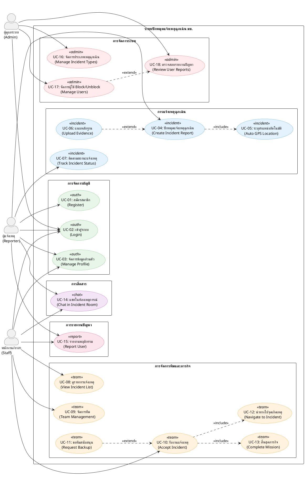
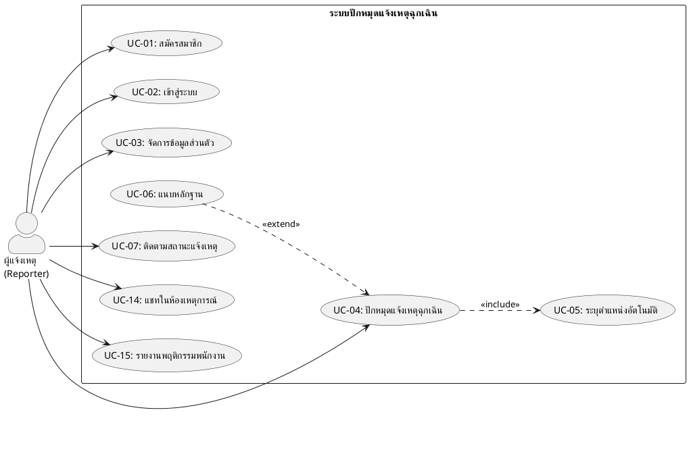
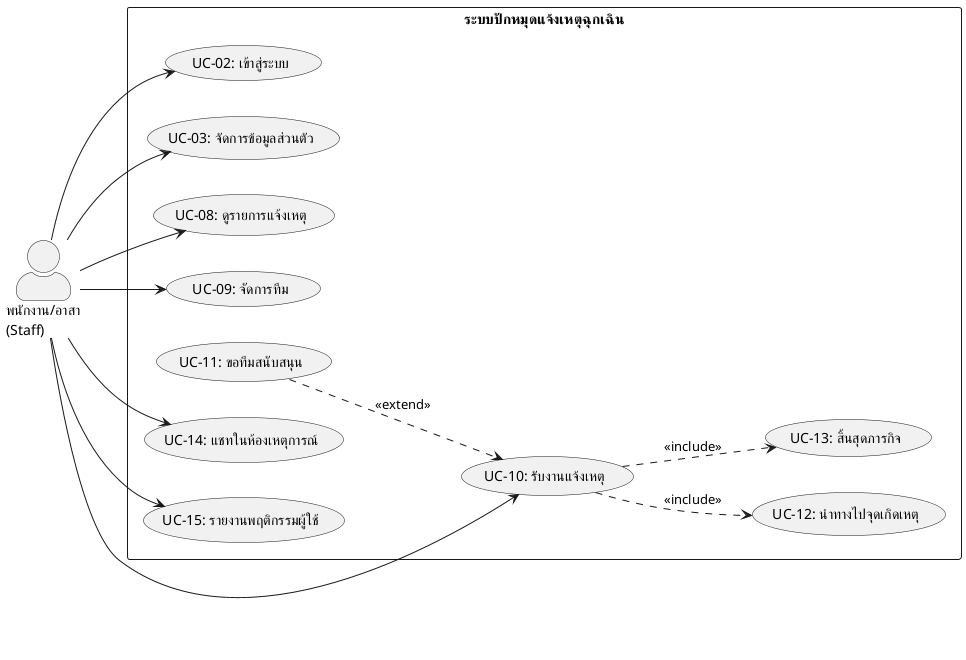
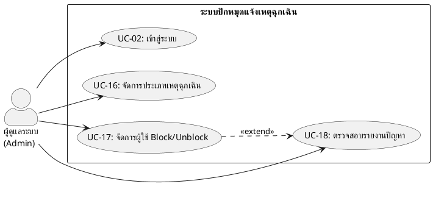
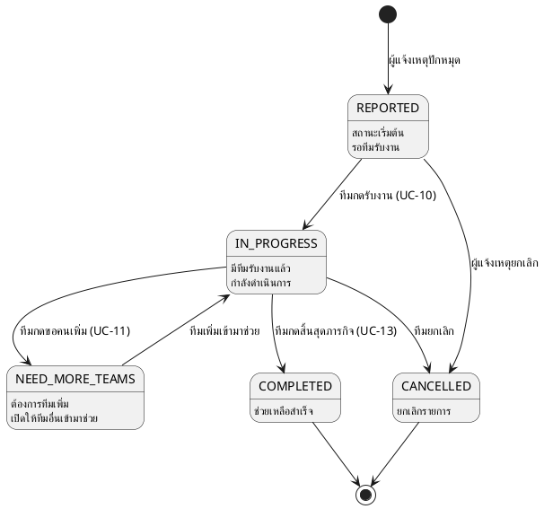

# Use Case Diagram

**ระบบปักหมุดแจ้งเหตุฉุกเฉินเรียลไทม์ในมหาวิทยาลัยขอนแก่น**
*(Real-time Emergency Pin-Alert Web Application for Khon Kaen University)*

---

## 1. Use Case Diagram (ภาพรวมทั้งระบบ)

---

## 2. Use Case Diagram แยกตาม Actor

### 2.1 ผู้แจ้งเหตุ (Reporter)

### 2.2 พนักงาน/อาสา (Staff/Volunteer)

### 2.3 ผู้ดูแลระบบ (Admin)

---

## 3. Use Case Description (รายละเอียด)

### 3.1 การจัดการบัญชี (Authentication)

| ID | Use Case | Actor(s) | คำอธิบาย | Pre-condition | Post-condition |
|:---|:---------|:---------|:---------|:-------------|:--------------|
| UC-01 | สมัครสมาชิก (Register) | Reporter | ผู้ใช้สร้างบัญชีใหม่โดยกรอก Email, ชื่อ-สกุล, เบอร์โทร, รหัสผ่าน | ยังไม่มีบัญชีในระบบ | มีบัญชีในระบบ, ได้รับ JWT Token |
| UC-02 | เข้าสู่ระบบ (Login) | Reporter, Staff, Admin | ผู้ใช้กรอก Email และ Password เพื่อเข้าสู่ระบบ | มีบัญชีอยู่ในระบบ, ไม่ถูก Block | ได้รับ JWT Token, เข้าหน้าหลักตาม Role |
| UC-03 | จัดการข้อมูลส่วนตัว (Manage Profile) | Reporter, Staff | แก้ไขข้อมูลส่วนตัว เช่น ชื่อ, เบอร์โทร, รหัสผ่าน | เข้าสู่ระบบแล้ว | ข้อมูลถูกอัปเดตในระบบ |

### 3.2 การแจ้งเหตุฉุกเฉิน (Incident Management)

| ID | Use Case | Actor(s) | คำอธิบาย | Pre-condition | Post-condition |
|:---|:---------|:---------|:---------|:-------------|:--------------|
| UC-04 | ปักหมุดแจ้งเหตุฉุกเฉิน (Create Incident Report) | Reporter | เลือกประเภทเหตุการณ์จาก dropdown, กรอกรายละเอียด (optional), กรอกเบอร์ติดต่อ ระบบจะปักหมุดตำแหน่ง GPS อัตโนมัติ | เข้าสู่ระบบแล้ว | รายการแจ้งเหตุถูกสร้าง สถานะ = REPORTED |
| UC-05 | ระบุตำแหน่งอัตโนมัติ (Auto GPS Location) | Reporter | ระบบดึงพิกัด GPS (Latitude, Longitude) ของผู้แจ้ง ณ จุดเกิดเหตุ โดยอัตโนมัติ | Browser อนุญาต Geolocation | ได้พิกัดที่แม่นยำภายใน 3 วินาที |
| UC-06 | แนบหลักฐาน (Upload Evidence) | Reporter | อัปโหลดรูปภาพ, วิดีโอ, หรือคลิปเสียงประกอบการแจ้งเหตุ | กำลังสร้างรายการแจ้งเหตุ | ไฟล์ถูกอัปโหลดขึ้น ImageKit CDN |
| UC-07 | ติดตามสถานะแจ้งเหตุ (Track Incident Status) | Reporter | ดูและติดตามสถานะแจ้งเหตุแบบเรียลไทม์ (REPORTED → IN_PROGRESS → COMPLETED) | มีรายการแจ้งเหตุ | เห็นสถานะล่าสุดของรายการ |

### 3.3 การจัดการทีมและภารกิจ (Team & Mission)

| ID | Use Case | Actor(s) | คำอธิบาย | Pre-condition | Post-condition |
|:---|:---------|:---------|:---------|:-------------|:--------------|
| UC-08 | ดูรายการแจ้งเหตุ (View Incident List) | Staff | แสดงรายการแจ้งเหตุทั้งหมด เรียงตามระดับความสำคัญ (priority_level) จากสูงไปต่ำ | เข้าสู่ระบบแล้ว (Staff) | เห็นรายการแจ้งเหตุเรียงตามความสำคัญ |
| UC-09 | จัดการทีม (Team Management) | Staff | สร้างทีม, สังกัดทีม, ย้ายทีม, ออกจากทีม | เข้าสู่ระบบแล้ว (Staff) | สมาชิกทีมถูกอัปเดต |
| UC-10 | รับงานแจ้งเหตุ (Accept Incident) | Staff | ทีมกดรับงาน ระบบเปลี่ยนสถานะทีมเป็น ON_MISSION และแจ้งเตือนผู้แจ้งเหตุ | ทีมสถานะ AVAILABLE, รายการสถานะ REPORTED หรือ NEED_MORE_TEAMS | สถานะทีม = ON_MISSION, สถานะรายการ = IN_PROGRESS |
| UC-11 | ขอทีมสนับสนุน (Request Backup) | Staff | กรณีทีมไม่เพียงพอ กดร้องขอทีมเพิ่ม ระบบจะเปิดให้ทีมอื่นเข้ามาช่วย | ทีมกำลังทำภารกิจอยู่ | สถานะรายการ = NEED_MORE_TEAMS, max_teams เพิ่มขึ้น |
| UC-12 | นำทางไปจุดเกิดเหตุ (Navigate to Incident) | Staff | แสดงพิกัดจุดเกิดเหตุบนแผนที่ พร้อมเชื่อมโยงระบบนำทาง | รับงานแล้ว | แสดงเส้นทางไปจุดเกิดเหตุ |
| UC-13 | สิ้นสุดภารกิจ (Complete Mission) | Staff | กดปุ่มเสร็จสิ้นภารกิจ ระบบเปลี่ยนสถานะทีมกลับเป็น AVAILABLE | ทีมสถานะ ON_MISSION | สถานะทีม = AVAILABLE, สถานะรายการ = COMPLETED |

### 3.4 การสื่อสาร (Communication)

| ID | Use Case | Actor(s) | คำอธิบาย | Pre-condition | Post-condition |
|:---|:---------|:---------|:---------|:-------------|:--------------|
| UC-14 | แชทในห้องเหตุการณ์ (Chat in Incident Room) | Reporter, Staff | สนทนาและส่งไฟล์ภาพภายในห้องแชทเฉพาะเหตุการณ์ (1 รายการ = 1 ห้องแชท) ทุก Staff ในทีมที่รับงาน + ผู้แจ้งเหตุสามารถส่งข้อความได้ | มีรายการแจ้งเหตุที่มีทีมรับงานแล้ว | ข้อความ/ไฟล์ถูกส่งและแสดงแบบเรียลไทม์ |

### 3.5 การรายงานปัญหา (User Report)

| ID | Use Case | Actor(s) | คำอธิบาย | Pre-condition | Post-condition |
|:---|:---------|:---------|:---------|:-------------|:--------------|
| UC-15 | รายงานพฤติกรรม (Report User) | Reporter, Staff | รายงานพฤติกรรมที่ไม่เหมาะสมของผู้ใช้อื่น เช่น แจ้งเหตุเท็จ, พฤติกรรมไม่เหมาะสม | เข้าสู่ระบบแล้ว | รายงานถูกสร้าง สถานะ = PENDING |

### 3.6 การจัดการระบบ (System Administration)

| ID | Use Case | Actor(s) | คำอธิบาย | Pre-condition | Post-condition |
|:---|:---------|:---------|:---------|:-------------|:--------------|
| UC-16 | จัดการประเภทเหตุฉุกเฉิน (Manage Incident Types) | Admin | เพิ่ม, ลบ, แก้ไขประเภทเหตุฉุกเฉิน กำหนดชื่อ, ระดับความสำคัญ, เปิด/ปิดใช้งาน | เข้าสู่ระบบแล้ว (Admin) | ประเภทเหตุฉุกเฉินถูกอัปเดตในระบบ |
| UC-17 | จัดการผู้ใช้ Block/Unblock (Manage Users) | Admin | ระงับหรือยกเลิกการระงับบัญชี Reporter หรือ Staff พร้อมระบุเหตุผล | เข้าสู่ระบบแล้ว (Admin), มีบัญชีเป้าหมาย | สถานะ is_blocked ถูกเปลี่ยน, บันทึกลง block_history |
| UC-18 | ตรวจสอบรายงานปัญหา (Review User Reports) | Admin | ดูรายการ Report ตรวจสอบ และอัปเดตสถานะ (REVIEWED / DISMISSED) พร้อมเขียนบันทึก | มี Report สถานะ PENDING | สถานะ Report ถูกอัปเดต, อาจนำไปสู่การ Block |

---

## 4. Relationships Summary

### 4.1 Include Relationships (<<include>>)

| Base Use Case | Included Use Case | คำอธิบาย |
|:-------------|:-----------------|:---------|
| UC-04 ปักหมุดแจ้งเหตุ | UC-05 ระบุตำแหน่งอัตโนมัติ | ทุกครั้งที่แจ้งเหตุ ต้องดึง GPS เสมอ |
| UC-10 รับงานแจ้งเหตุ | UC-12 นำทางไปจุดเกิดเหตุ | เมื่อรับงานแล้ว ระบบจะแสดงเส้นทางทันที |
| UC-10 รับงานแจ้งเหตุ | UC-13 สิ้นสุดภารกิจ | เมื่อรับงานแล้ว ต้องสิ้นสุดภารกิจเมื่อเสร็จ |

### 4.2 Extend Relationships (<<extend>>)

| Base Use Case | Extended Use Case | เงื่อนไข |
|:-------------|:-----------------|:---------|
| UC-04 ปักหมุดแจ้งเหตุ | UC-06 แนบหลักฐาน | ผู้ใช้เลือกแนบหลักฐานเพิ่มเติม (optional) |
| UC-10 รับงานแจ้งเหตุ | UC-11 ขอทีมสนับสนุน | ทีมไม่เพียงพอ ต้องการคนเพิ่ม |
| UC-18 ตรวจสอบ Report | UC-17 จัดการ Block/Unblock | Admin ตรวจแล้วเห็นว่าต้อง Block ผู้ใช้ |

---

## 5. Incident Status Flow

---

*เอกสารนี้จัดทำจาก Requirements Specification ของโปรเจค ณ วันที่ 26 มีนาคม 2569*
